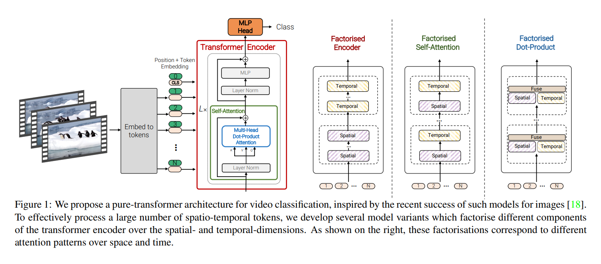
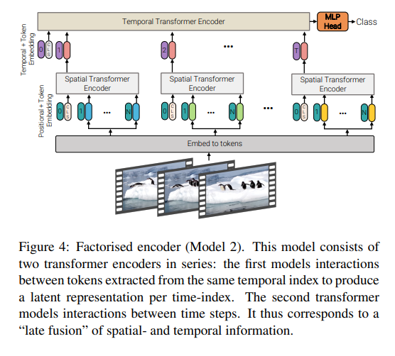
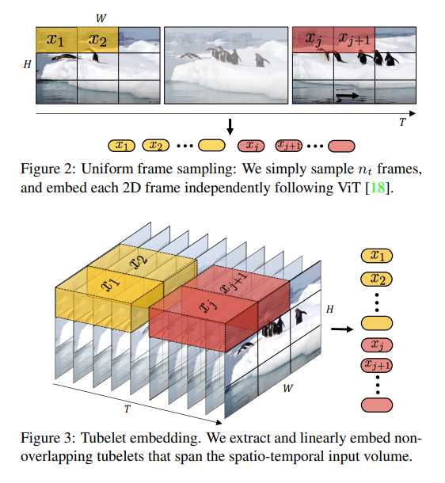

# ViViT
[Video Vision Transformer](https://arxiv.org/pdf/2103.15691) implementation in pytorch

[//]: # (![ViViT architectures]&#40;assets/vivit_models.png&#41;)
<p style="text-align: center;">
    
</p>

## Architecture
Original [Video Vision Transformer](https://arxiv.org/pdf/2103.15691) paper presents 4 different ViViT architectures. This repository implements only the Model2: Factorised Encoder
<p style="text-align: center;">
    
</p>

## Embedding
Original [Video Vision Transformer](https://arxiv.org/pdf/2103.15691) also uses two types of embedding. Uniform and Tubelet.
This implementation provides option to use both types of embedding. For uniform embedding use `tubelet_size: 1`, `use_vit: True` for Conv2d implementation and `use_vit: False` for Conv3d implementation. See [`configs/example_config.yaml`](configs/example_config.yaml) for details.

<p style="text-align: center;">
    
</p>

# Installation
```
git clone https://github.com/zeleznyt/ViViT.git
cd ViViT
conda create --name vivit python=3.10
conda activate vivit
pip install -r requirements.txt
```

# Data
Example data are located in [example_data_RAVDAI](https://github.com/zeleznyt/example_data_RAVDAI) repository.
```
git clone https://github.com/zeleznyt/example_data_RAVDAI.git
```

# Usage
### Train
```
cd ViViT
conda activate vivit
python train_vivit.py --config configs/example_config.yaml
```

### Eval
```
cd ViViT
conda activate vivit
To be added:
# python eval_vivit.py --config configs/example_config.yaml
```

